# 1 Giới thiệu
Là một developer mới vào nghề chưa lâu nhưng mình đã nghe rất nhiều về kỹ thuật TDD, và mình đang tìm hiểu kỹ thuật TDD để áp dụng vào công việc, nôm na TDD là kỹ thuật phát triển theo hướng viết test trước rồi code sau. Ở bài viết này mình sẽ thực hành kỹ thuật này trên một app CRUD đơn giản với laravel. Các bước thực hiện như sau:

- Phân tích chức năng mình sẽ implement
- Viết các feature/unit test để test chức năng này, cover được càng nhiều trường hợp càng tốt
- Chạy các test case này và viết code để pass hết tất cả các test case này
- Một khi tất cả các test case đã pass, refactor và tối ưu lại code 
- Tiếp tục chạy test lại để đảm bảo việc refactor không ảnh hưởng đến logic code

# 2 Tạo model và các factory

Thông thường một ứng dụng sẽ có rất nhiều model nhưng mình sẽ bắt đầu với một to-do app đơn giản, chỉ gồm 2 model là users và tasks. Mặc định khi tạo project laravel thì model đã được tạo sẵn. Mình sẽ tạo các chức năng authentication cho app với model users.

```bash
php artisan make:auth
```

Lệnh này sẽ tự động sinh ra các file cần cho các chức năng athentication (login, logout, registration, forget password...)

Tiếp theo, mình sẽ tạo model và controller cho task.

```bash
php artisan make:model Task -mr
```
Lệnh này sẽ tạo model Task và một file migration xxx_xx_xx_xxxxxx_create_tasks_table, thêm các cột cần thiết trong function up() trong file này như sau

```php
public function up()
{
    Schema::create('tasks', function (Blueprint $table) {
        $table->increments('id');
        $table->unsignedInteger('user_id');
        $table->string('title');
        $table->text('description');
        $table->timestamps();
    });
}
```

Và chạy lệnh để tạo bảng

```bash
php artisan migrate
```

Bây giờ chúng ta sẽ tạo factory để sinh dữ liệu ảo phục vụ cho việc test, mặc định model User đã có sẵn factory trong đường dẫn database/factories/UserFactory.php . Vì thế mình chỉ cần tạo factory cho model tasks

```bash
php artisan make:factory TaskFactory --model=Task
```

Chỉnh sửa TaskFactory như sau

```php
$factory->define(App\Task::class, function (Faker $faker) {
    return [
        'title' => $faker->sentence,
        'description' => $faker->paragraph,
        'user_id' => factory('App\User')->create()->id,
    ];
});
```

# 3 Bắt đầu với TDD
Giờ chúng ta sẽ bắt đàu với TDD, ở đây mình sẽ viết test trong thư mục tests, thư mục này có 2 thư mục con là Unit và Feature, trong mỗi thư mục con này có một file `ExampleTest.php`, ta sẽ xóa chúng đi.

## 3.1 Một User có thể xem tất cả các tasks [READ]
Chúng ta sẽ viết những test case đầu tiên. Tạo một file TasksTest.php trong thư mục tests/Feature
 và viết các test case. Chức năng đầu tiên là User có thể xem tất cả các tasks có trong database. Ta sẽ viết test cho case này
```php
<?php

namespace Tests\Feature;

use Tests\TestCase;
use Illuminate\Foundation\Testing\DatabaseMigrations;

class TasksTest extends TestCase
{
    use DatabaseMigrations;
    
    /** @test */
    public function a_user_can_read_all_the_tasks()
    {
        //Given we have task in the database
        $task = factory('App\Task')->create();

        //When user visit the tasks page
        $response = $this->get('/tasks');
        
        //He should be able to read the task
        $response->assertSee($task->title);
    }
}
```

Giờ hãy chạy các test trong file này

```bash
vendor/bin/phpunit tests/Feature/TasksTest
```
Kết quả: Test sẽ fail vì ta chưa implement bất kỳ đoạn code nào cho chúc năng này, bấy giờ chúng ta sẽ viết code để pass test


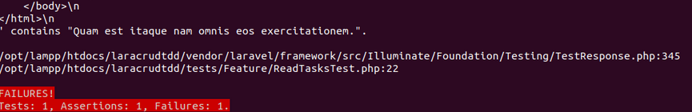

Viết code để hiển thị danh sách task trong hàm index trong TaskController

```php
/**
 * Display a listing of the resource.
 *
 * @return \Illuminate\Http\Response
 */
public function index()
{
    $tasks = Task::latest()->get();
    return view('tasks.index',compact('tasks'));
}
```

Tạo một file index.blade.php trong thư mục resources/tasks

```php
@extends('layouts.app')

@section('content')
    <div class="container">
        <div class="row justify-content-center">
            <div class="col-md-8">
                <div class="page-header">
                    <h2>All Tasks</h2>
                </div>
                @foreach($tasks as $task)
                <div class="card">
                    <div class="card-header">{{$task->title}}</div>

                    <div class="card-body">
                        {{$task->description}}
                    </div>
                </div>
                @endforeach
            </div>
        </div>
    </div>
@endsection
```

Và chạy lại các test case

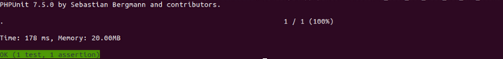

## 3.2 Một User có thể tạo mới tasks [CREATE]
Oke, giờ chúng ta qua chức năng create, khác với chức năng list, chức năng này cần user đăng nhập vào hệ thống mới sử dụng được, bây giờ chúng ta sẽ viết một số test case cho chức năng này

```php
/** @test */
public function authenticated_users_can_create_a_new_task()
{
    //Given we have an authenticated user
    $this->actingAs(factory('App\User')->create());
    //And a task object
    $task = factory('App\Task')->make();
    //When user submits post request to create task endpoint
    $this->post('/tasks/create',$task->toArray());
    //It gets stored in the database
    $this->assertEquals(1,Task::all()->count());
}
```

Chạy test, và tất nhiên nó sẽ failed vì chúng ta chưa implement code cho chức năng này. 

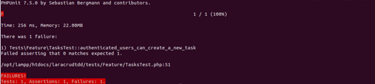

Bây giờ chúng ta sẽ viết code cho chức năng này, thêm route trong web.php

```php
Route::post('/tasks/create','TaskController@store');
```

Chỉnh sửa hàm stroe trong TaskController

```php
/**
 * Store a newly created resource in storage.
 *
 * @param  \Illuminate\Http\Request  $request
 * @return \Illuminate\Http\Response
 */
public function store(Request $request)
{
    $task = Task::create([
        'title' => $request->get('title'),
        'description' => $request->get('description'),
        'user_id' => Auth::id()
    ]);

    return redirect('/tasks/'.$task->id);
}
```
Định nghĩa các thuộc tính có thể được fill trong model task 

```php
class Task extends Model
{
    protected $fillable = [
        'title', 'description', 'user_id',
    ];
}
```

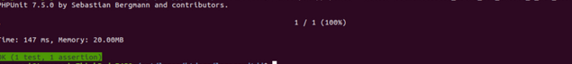

Chạy lại test và nó đã pass. Nhưng chức năng này cần test thêm trường hợp user tiến hành tạo task nhưng chưa đăng nhập vào hệ thống. Chúng ta sẽ viết một test case khác cho trường hợp này

```php
public function unauthenticated_users_cannot_create_a_new_task()
{
    //Given we have a task object
    $task = factory('App\Task')->make();
    //When unauthenticated user submits post request to create task endpoint
    // He should be redirected to login page
    $this->post('/tasks/create',$task->toArray())
         ->assertRedirect('/login');
}
```

Chạy test và lỗi này sẽ xuất hiện.

```
Caused by
PDOException: SQLSTATE[23000]: Integrity constraint violation: 19 tasks.user_id may not be NULL
```

Tuy nhiên lỗi này xảy ra ở bước lưu vào database và nó cho thấy user dù chưa đăng nhập vẫn đi tới được bước lưu vào database mà không bị chuyenr hướng về trang login. Ta cần phải fix cái này

Chỉnh sửa hàm construct trong TaskController như sau

```php
public function __construct(){
    $this->middleware('auth')->except(['index','show']);
}
```

Sau đó chạy lại test

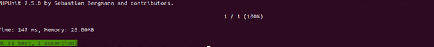

Bây giờ endpoint của chức năng tạo task đã sẵn sàng, thứ chúng ta cần làm bây giờ là tạo một trang giao diện cho chức năng này và kiểm tra các validation có hoạt động hay không

Tạo thêm một route dẫn đến trang giao diện của chức năng create trong web.php

```php
Route::get('/tasks/create','TaskController@create');
```

Chỉnh sửa phương thức create trong TaskController.php để trả về  file view khi được gọi đến

```php
/**
 * Show the form for creating a new resource.
 *
 * @return \Illuminate\Http\Response
 */
public function create()
{
    return view('tasks.create');
}
```

Tiếp theo, tạo một file giao diện create.blade.php trong thư mục resources/views/tasks

```php
@extends('layouts.app')
@section('content')
    <div class="container">
        <div class="row justify-content-center">
            <div class="col-md-8">
                <div class="card">
                        <div class="card-header"><strong>Add a new task</strong></div>

                        <div class="card-body">
                            <form method="POST" action="/tasks/create">
                                {{csrf_field()}}
                                <div class="form-group">
                                    <input type="text" class="form-control" name="title" id="title" placeholder="Enter a title for your task">
                                </div>
                                <div class="form-group">
                                    <textarea class="form-control" name="description" placeholder="Provide a description for your task" rows="8">
                                    </textarea>
                                </div>
                                <button class="btn btn-primary" type="Submit" >Add Task</button>
                            </form>
                        </div>
                </div>
            </div>
        </div>
    </div>
@endsection
```

Đảm bảo rằng file view của bạn có các thứ sau:
- Một thẻ form vói method post trỏ đến /tasks/create
- Các trường với thuộc tính name là title và description vaf một submit button
- {{csrf_field()}} để ngăn chặn cross site scripting attack.

Test validation

Chức năng tạo mới task gần như đã sẵn sàng để sử dụng, tuy nhiên chúng ta vẫn chưa xửa lí validation cho chức năng này. Nếu người dùng gửi form mà không nhập gì, khi tạo task sẽ phát sinh lỗi ở phía database. Bay giò chúng ta sẽ tạo validation, đầu tiên chúng ta sẽ viết test để cover validation


```php
/** @test */
public function a_task_requires_a_title(){

    $this->actingAs(factory('App\User')->create());

    $task = factory('App\Task')->make(['title' => null]);

    $this->post('/tasks/create',$task->toArray())
            ->assertSessionHasErrors('title');
}

/** @test */
public function a_task_requires_a_description(){

    $this->actingAs(factory('App\User')->create());

    $task = factory('App\Task')->make(['description' => null]);

    $this->post('/tasks/create',$task->toArray())
        ->assertSessionHasErrors('description');
}
```

Ở đây có 2 test case để  test validation cho cả 2 fields title và description. Trong test này chúng ta sẽ giả định người dùng gửi lên giá trị null để tạo task và chúng ta mong đợi session sẽ chứa thông tin error về 2 fields này.

Run the test and it will fail. Since we don’t have validation in place yet.
Khi thực thi test sẽ bị failed vì chúng ta chưa tạo validation cho chức năng tạo mới task.

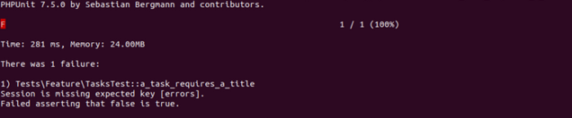

Bây giờ chúng ta sẽ implement phần validation. Chỉnh sửa phương thức store trong TaskController

```php
public function store(Request $request)
{

    $request->validate([
        'title' => 'required',
        'description' => 'required'
    ]);

    $task = Task::create([
        'title' => $request->get('title'),
        'description' => $request->get('description'),
        'user_id' => Auth::id()
    ]);

    return redirect('/tasks/'.$task->id);
}
```

Chạy lại task và hi vọng chúng sẽ pass :D

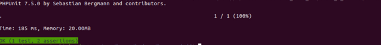

Chúng ta cũng xử lý ở phía front-end để đổ ra các thông báo lỗi này ở from tạo mới task

```php
@if(count($errors))
    <div class="alert alert-danger">
        @foreach($errors->all() as $error)
            <li>
                {{$error}}
            </li>
        @endforeach
    </div>
@endif
```

Và bây giờ validation đã hoạt động.

## 3.3 Một User có thể chỉnh sửa tasks [UPDATE]

Bây giờ chúng ta sẽ chuyển sang chức năng update. Một user đã login có thể  cập nhật các task của mình

Tạo một test case trong class TaskTest.

```php


/** @test */
public function authorized_user_can_update_the_task(){

    //Given we have a signed in user
    $this->actingAs(factory('App\User')->create());
    //And a task which is created by the user
    $task = factory('App\Task')->create(['user_id' => Auth::id()]);
    $task->title = "Updated Title";
    //When the user hit's the endpoint to update the task
    $this->put('/tasks/'.$task->id, $task->toArray());
    //The task should be updated in the database.
    $this->assertDatabaseHas('tasks',['id'=> $task->id , 'title' => 'Updated Title']);
}
```

Ở đây chúng ta tạo và lưu trước một task vào database và sau đó chúng ta sẽ giải định User sẽ chỉnh sửa title bằng cách gửi một request đến đường dẫn /task/$task->id. Sau đó mong đợi rằng thay đổi sẽ được lưu vào database

Bây giờ hãy chạy test, nó sẽ failed vì chúng ta chưa có API endpoint để update task

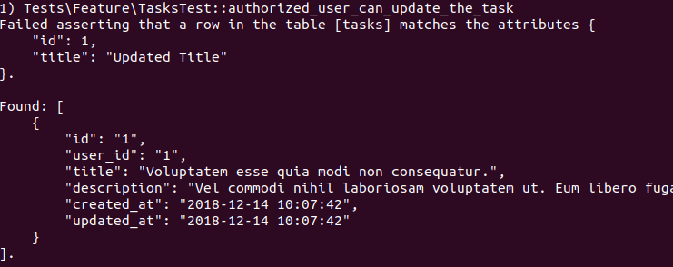

Và bây giờ chúng ta sẽ implement code cho API endpoint này. Thêm đoạn code sau vào web.php.

```php
Route::put('/tasks/{task}','TaskController@update');
```

Chihr sửa hàm update trong TaskController class.

```php
/**
 * Update the specified resource in storage.
 *
 * @param  \Illuminate\Http\Request  $request
 * @param  \App\Task  $task
 * @return \Illuminate\Http\Response
 */
public function update(Request $request, Task $task)
{
    $task->update($request->all());
    return redirect('/tasks/'.$task->id);
}
```

Chạy lại test.

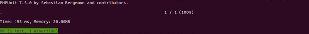

Tiếp theo chúng ta sẽ đảm bảo rằng user chưa đăng nhập sẽ không thể sửa task thông qua API Endpoint. Hãy tưởng tượng bạn tạo một task và một người nào đó có thể chỉnh sửa nó. Chúng ta phải ngăn chặn điều này.

Tạo một test có tên unauthorized_user_cannot_update_the_task.

```php
/** @test */
public function unauthorized_user_cannot_update_the_task(){
    //Given we have a signed in user
    $this->actingAs(factory('App\User')->create());
    //And a task which is not created by the user
    $task = factory('App\Task')->create();
    $task->title = "Updated Title";
    //When the user hit's the endpoint to update the task
    $response = $this->put('/tasks/'.$task->id, $task->toArray());
    //We should expect a 403 error
    $response->assertStatus(403);
}

```

Khi một người dùng đăng nhập vào hệ thống và cố gắng chỉnh sửa một task của một người dùng khác. Chúng ta mong đợi rằng hệ thống sẽ gửi về một lỗi UnAuthorized Error và một 403 response status.

Chạy các test và dĩ nhiên chúng sẽ failed vì ta chưa implement cho chức năng này.

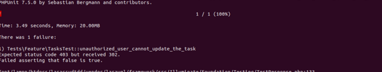

Tạo một policy thông qua artisan command

```bash
php artisan make:policy TaskPolicy --model=Task
```

Artisan command sẽ tạo một một file TaskPolicy trong thư mục app/Policies/TaskPolicy.php. Chúng ta sẽ chỉnh sửa phương thức update

```php
/**
 * Determine whether the user can update the task.
 *
 * @param  \App\User  $user
 * @param  \App\Task  $task
 * @return mixed
 */
public function update(User $user, Task $task)
{
    return $task->user_id == $user->id;
}
```

Để cập nhật task, các user_id của task phải giống với id của người dùng hiện tại. Điều này có nghĩa, người dùng chỉ có thể thực hiện hành động chỉnh sửa đối với các mà mình đã tạo.


Tiếp theo, chúng ta cần đăng ký policy này trong AuthServiceProvider.php được đặt trong ứng dụng thư mục/Providers

Cập nhật policies array như sau

```php
protected $policies = [
    'App\Task' => 'App\Policies\TaskPolicy',
];
```

Tiếp theo sửa đổi phương thức update để bao gồm authorize code

```php
public function update(Request $request, Task $task)
{
    $this->authorize('update', $task);

    $task->update($request->all());
    return redirect('/tasks/'.$task->id);
}
```

Chạy lại test

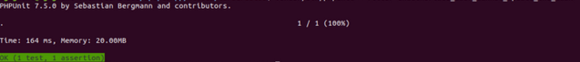

Tiếp theo là phần giao diện của update task. Thêm một route vào web.php

```php
Route::get('/tasks/{task}/edit','TaskController@edit');
```

Sửa đổi phương thức edit của TaskContoder

```php
/**
 * Show the form for editing the specified resource.
 *
 * @param  \App\Task  $task
 * @return \Illuminate\Http\Response
 */
public function edit(Task $task)
{
    return view('tasks.edit',compact('task'));
}
```

Thêm một view file để hiển thị form edit task có tên edit.blade.php trong thư mục resources/views/tasks

```php
@extends('layouts.app')
@section('content')
    <div class="container">
        <div class="row justify-content-center">
            <div class="col-md-8">
                <div class="card">
                        <div class="card-header"><strong>Update task</strong></div>

                        <div class="card-body">
                            <form method="POST" action="/tasks/{{$task->id}}">
                                {{csrf_field()}}
                                {{method_field('PUT')}}
                                <div class="form-group">
                                    <input type="text" class="form-control" name="title" id="title" placeholder="Enter a title for your task" value="{{$task->title}}">
                                </div>
                                <div class="form-group">
                                    <textarea class="form-control" name="description" placeholder="Provide a description for your task" rows="8">{{$task->description}}
                                    </textarea>
                                </div>
                                <button class="btn btn-primary" type="Submit" >Edit Task</button>
                            </form>
                        </div>
                </div>

                @if(count($errors))
                    <div class="alert alert-danger">
                        @foreach($errors->all() as $error)
                            <li>
                                {{$error}}
                            </li>
                        @endforeach
                    </div>
                @endif
            </div>
        </div>
    </div>
@endsection

<div class="card-footer">
    @can('update', $task)
    <a href="/tasks/{{$task->id}}/edit" class="btn btn-warning">Edit Task</a>
    @endcan
</div>
```

Chúng tôi sử dụng tag @can. Điều đó có nghĩa là nút Chỉnh sửa sẽ chỉ được hiển thị nếu người dùng có quyền cập nhật.


Bây giờ sẽ là phần cuối của app CRUD - delete

## 3.1 Một User có thể xóa một task bất kỳ [DELETE]

Người dùng cũng có thể xóa các tác vụ của họ, Hãy thêm một test mới cho  vơi tên authorized_user_can_delete_the_task

```php
/** @test */
public function authorized_user_can_delete_the_task(){

    //Given we have a signed in user
    $this->actingAs(factory('App\User')->create());
    //And a task which is created by the user
    $task = factory('App\Task')->create(['user_id' => Auth::id()]);
    //When the user hit's the endpoint to delete the task
    $this->delete('/tasks/'.$task->id);
    //The task should be deleted from the database.
    $this->assertDatabaseMissing('tasks',['id'=> $task->id]);

}
```

Ở đây, chúng ta cố gắng thực hiện một request bằng url và sau đó mong đợi rằng task sẽ bị xóa trong database

Chạy test và failed

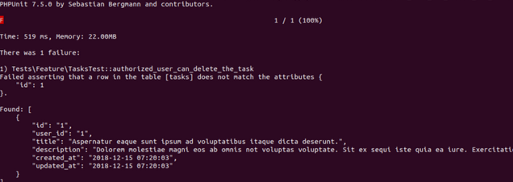

Thêm một route cho chức năng delete trong file web.php

```php
Route::delete('/tasks/{task}','TaskController@destroy');
```

Tiếp theo, chỉnh sửa phương thức delete trong TaskController để xử lý request delete.

```php
/**
 * Remove the specified resource from storage.
 *
 * @param  \App\Task  $task
 * @return \Illuminate\Http\Response
 */
public function destroy(Task $task)
{
    $this->authorize('update', $task);

    $task->delete();

    return redirect("/tasks");
}
```

Bây giờ chúng ta sẽ tạo một test khác để chắc chắn rằng User không thể xóa task của user khác.

```php
/** @test */
public function unauthorized_user_cannot_delete_the_task(){
    //Given we have a signed in user
    $this->actingAs(factory('App\User')->create());
    //And a task which is not created by the user
    $task = factory('App\Task')->create();
    //When the user hit's the endpoint to delete the task
    $response = $this->delete('/tasks/'.$task->id);
    //We should expect a 403 error
    $response->assertStatus(403);
}
```

Chạy lại tất cả các test

```
vendor/bin/phpunit
```

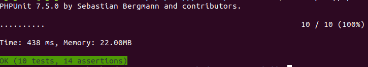

Và như chúng ta thấy, tất cả các test dã pass

# 4. Kết
Trên đây là một ví dụ app CRUD đơn giản bao gồm cả phân quyền và chứng thực người dùng được phát triển bằng phương pháp TDD. Cám ơn các bạn đã quan tâm.